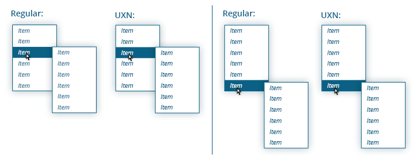

<h1>UXN 1.0 - Documentation</h1>

(hopefully in English)

UXN is a tool for creating user-friendly navigations. It tracks, whether the mouse is moving towards some (sub)menu, and if so, then the menu stays opened. As a result, the user need not to browse through the navigation like a robot and be moving the mouse at right angles (see the animation below).

The second function of UXN is adjusting positions of submenus into the browser's window (page or element).

UXN works exclusively on the basis of classes and thus it doesn't modify the <code>style</code> attribute of elements. All class names can be changed however you want.

UXN uses native methods and APIs (<code>closest</code>, <code>matches</code>, <code>classList</code>, ...), if they are available to ensure maximum efficiency.

Demo: <a href="http://michaljerabek.github.io/UXN#2">michaljerabek.github.io/UXN</a>

<figure></figure>

<h2>Dependencies</h2>

<strong>jQuery</strong> - tested with version 1.11.3

<h2>Browser support</h2>

All browsers supported by jQuery. Although older browsers (IE7 and lower) can be too slow.

<h2>Basic usage</h2>

<h3>JavaScript</h3>

<pre>var mainNav = new UXN("#main-nav");

//or
var mainNav = new UXN({
    nav: "#main-nav",
    itemOpened: "custom-opened-class"
});</pre>

The default selectors for the submenus and items are <code>ul</code> and <code>li</code>. These can be changed by <code>subnav</code> and <code>item</code> properties. It's important that these selctors do not select any other elements than elements of submenus or items.

Note: Do not use selectors like <code>#main-nav .subnav</code>, but only <code>.subnav</code>.

Note: <code>nav</code> selector does not have to be an <code>id</code>, but it must be unique.

Note: The default value of the <code>nav</code> property is <code>#main-nav</code>. So if your navigation has the <code>id</code> <code>#main-nav</code>, you can use just <code>new UXN();</code>.

<h3>HTML</h3>

Basic navigation:

<pre>&lt;nav id=&quot;main-nav&quot;&gt;  
    &lt;ul&gt;
        &lt;li&gt;
            &lt;a href=&quot;#&quot;&gt;link&lt;/a&gt;  
            &lt;ul&gt;
                &lt;li&gt;...&lt;/li&gt;
                ...
            &lt;/ul&gt;  
        &lt;/li&gt;
        ...
    &lt;/ul&gt;  
&lt;/nav&gt;</pre>

On touch devices may be useful to use a dedicated opening element (see demo <a href="http://michaljerabek.github.io/UXN#3">#3</a>), if we want to be able to use item's link and be able to open a submenu inside the item. The HTML could look like this:

<pre>&lt;nav id=&quot;main-nav&quot;&gt;  
    &lt;ul&gt;
        &lt;li&gt;
            &lt;a href=&quot;#&quot;&gt;link&lt;/a&gt;  
            &lt;div class=&quot;opener&quot;&gt;
                &lt;span&gt;&rarr;&lt;/span&gt;  
                &lt;ul&gt;
                    &lt;li&gt;...&lt;/li&gt;
                    ...
                &lt;/ul&gt;  
            &lt;/div&gt;  
        &lt;/li&gt;
        ...
    &lt;/ul&gt;  
&lt;/nav&gt;</pre>

Note: Selector for opening elements can be set by <code>opener</code> property.

Note: Last submenus do not have to have any item (see demo <a href="http://michaljerabek.github.io/UXN#4">#4</a>, <a href="http://michaljerabek.github.io/UXN#6">#6</a>, <a href="http://michaljerabek.github.io/UXN#7">#7</a>).

<h3>CSS</h3>

<pre>#main-nav li {
    position: relative;
    ...
}

#main-nav ul ul {
    position: absolute;
    top: 0px;
    left: 100%;
    
    display: none;
    ...
}        

#main-nav li.UXN__item--opened &gt; ul {
    display: block;
}        

#main-nav li.UXN__item--highlighted {
    background-color: red;
    ...
}        
</pre>

<h4>Usage with CSS Tranistions:</h4>

<pre>#main-nav li {
    position: relative;

    overflow: hidden;
    ...
}

#main-nav ul ul {
    position: absolute;
    top: 0px;
    left: 100%;
    
    opacity: 0;
    visibility: hidden;
    
    transition: 
    opacity    0.2s ease-in 0s, 
    visibility 0s           0.2s;
    ...
}        

#main-nav li.UXN__item--has-fading-out,
#main-nav li.UXN__item--opened {
    overflow: visible;
}        

#main-nav li.UXN__item--opened {
    background-color: red;
}        

#main-nav li.UXN__item--opened &gt; ul {
    opacity: 1;
    visibility: visible;
    
    transition: opacity 0.2s ease-out;
}        
</pre>

For more, see the <a href="http://michaljerabek.github.io/UXN#2">demo</a>.

<h2>Classes Used for Browsing a Menu</h2>

<h3>Initialization and Activation</h3>

<ul>
    <li>
        <code>UXN__item--has-subnav</code> (<code>itemHasSubnav</code>):
          - Item with a submenu.
    </li>

    <li>
        <code>UXN__opener--has-subnav</code> (<code>openerHasSubnav</code>):
          - Opening element with a submenu.
    </li>

    <li>
        <code>UXN</code> (<code>instance</code>):
          - Element which is an instance of UXN (set by the <code>nav</code> property).
    </li>

    <li>
        <code>UXN--active</code> (<code>activeInstance</code>):
          - Element which is an instance of UXN and a user is browsing the menu.
    </li>
</ul>

<h3>Opening of Submenu</h3>

<ul>
    <li>
        <code>UXN__item--opened</code> (<code>itemOpened</code>):
          - Item with an opened submenu. This class should not be used for setting any visual styles (<code>background-color</code>, ...) and should ensure only the opening of submenu (in the final position; [<code>display</code>, <code>transform</code>, <code>left</code>, ...]). (For visual styles can be used <code>UXN__item--highlighted</code>.)
    </li>

    <li>
        <code>UXN__opener--opened</code> (<code>openerOpened</code>):
          - Opening element with an opened submenu. This class should not be used for setting any visual styles (<code>background-color</code>, ...) and should ensure only the opening of submenu (in the final position; [<code>display</code>, <code>transform</code>, <code>left</code>, ...]). (For visual styles can be used <code>UXN__opener--highlighted</code>.)
        </li>

    <li>
        <code>UXN__item--highlighted</code> (<code>itemHighlighted</code>):
          - Item with an opened submenu.
    </li>

    <li>
        <code>UXN__opener--highlighted</code> (<code>openerHighlighted</code>):
          - Opening element with an opened submenu.
    </li>

    <li>
        <code>UXN__subnav--has-opened</code> (<code>subnavHasOpened</code>):
          - Submenu with an opened item.
    </li>

    <li>
        <code>UXN__subnav--current</code> (<code>currentSubnav</code>):
          - Submenu the mouse is over (or last was).
    </li>
</ul>

<h3>Closing of Submenu</h3>

<ul>

    <li>
        <code>UXN__item--has-fading-out</code> (<code>itemHasFadingOut</code>):
          - Item, which submenu is closing. (Only if <code>fading</code> is used.)
    </li>

    <li>
        <code>UXN__opener--has-fading-out</code> (<code>openerHasFadingOut</code>):
          - Opening element, which submenu is closing. (Only if <code>fading</code> is used.)
    </li>

    <li>
        <code>UXN__subnav--has-fading-out</code> (<code>subnavHasFadingOut</code>):
          - Submenu, which has a closing submenu. (Only if <code>fading</code> is used.)
    </li>

    <li>
        <code>UXN-no-fading</code> (<code>noFading</code>):
          - Submenu, that does not use transitions or animations. In case of some submenus use transitions or animations and some not, it's necessary to identify for which submenus should not be expected a <code>transitionend</code> / <code>animationend</code> event (or a <code>done</code> function call in case of using JS animations).
    </li>

    <li>
        <code>UXN-sliding--vertical</code> (<code>slidingVertical</code>):
          - It allows custom control of opening submenus. In case that a submenu has a <code>UXN-sliding--vertical</code> class, the submenu is opened without having to stop the mouse, if the mouse is moving vertically.
    </li>

    <li>
        <code>UXN-sliding--horizontal</code> (<code>slidingHorizontal</code>):
          - It allows custom control of opening submenus. In case that a submenu has a <code>UXN-sliding--horizontal</code> class, the submenu is opened without having to stop the mouse, if the mouse is moving horizontally.
        </li>
</ul>

Classes containing "fading" are important for the correct work of transitions and animations. They are mainly used to set the element to <code>overflow: visible;</code>, in order to its closing (fading) submenu would be visible.

<h3>Other</h3>

<ul>

    <li>
        <code>UXN-exclude</code> (<code>exclude</code>):
          - Submenu that should be excluded from the mouse tracking.
    </li>

    <li>
        <code>UXN-exclude--inside</code> (<code>excludeInside</code>):
          - Submenu that should be excluded from the mouse tracking, if the mouse is inside the submenu. (See demo <a href="http://michaljerabek.github.io/UXN#6">#6</a>.)
          - Useful only if <code>hideFollowing</code> is set to <code>false</code>.
    </li>

    <li>
        <code>UXN-horizontal</code> (<code>horizontal</code>):
          - Submenu, which is horizontal. (Important, if <code>allowSliding</code> is set to <code>true</code>. <a href="#allowSliding">More info</a>.)
    </li>
</ul>

<h2>Adjusting Positions</h2>

Basic process is as follows:

<ol>
    <li>Set styles for submenus to a default direction. (For example: Submenus will be positioned down right)</li>
    <li>Set styles to classes in the opposite direction. (For example: <code>UXN__subnav--top</code> and <code>UXN__subnav--left</code>.)</li>
</ol>

If a submenu fits into the window (page, element) and thus its position is not changed, the submenu will not have any class except in the case, that adjusting positions from the center is used. <a href="#firstLevelPositionsFromCenter">More info.</a>

If the positions are adjusted  based on the page (<code>&lt;html&gt;</code>) and the page is smaller then the browser's window, the window is used instead.

If a submenu does not fit into the window (page, element) even in the changed position, direction down right is preferred.

The first level of submenus can be adjusted by a different base then the others. In that case the property <code>firstLevelPositionsFromCenter</code> is set to <code>true</code>, if the property is not explicitly set to <code>false</code>. The other submenus will then continue the direction from the first level.

Setting the base for positioning:

<pre>var mainNav = new UXN({
    nav: "#main-nav",
    positionBase: UXN.POSITIONS.BASE.PAGE // UXN.POSITIONS.BASE.WINDOW // $("#wrapper") // document.getElementById("wrapper")
});</pre>

<h3>Classes Used for Adjusting Positions:</h3>

<ul>

    <li>
        <code>UXN-position--skip</code> (<code>positionSkip</code>):
          - It may be set to submenus that should not be positioned. Typically, the first level of submenus. (Can be set by <code>positionSkipOnFirstLevel: true</code>, in this case, you don't have to add these classes.)
    </li>

    <li>
        <code>UXN__subnav--left</code> (<code>subnavLeft</code>) |
        <code>UXN__subnav--right</code> (<code>subnavRight</code>) |
        <code>UXN__subnav--top</code> (<code>subnavTop</code>) |
        <code>UXN__subnav--bottom</code> (<code>subnavBottom</code>):
          - A submenu which should be positioned in the corresponding direction.
    </li>

    <li>
        <code>UXN__item--has--left</code> (<code>itemHasLeft</code>) |
        <code>UXN__item--has--right</code> (<code>itemHasRight</code>) |
        <code>UXN__item--has--top</code> (<code>itemHasTop</code>) |
        <code>UXN__item--has--bottom</code> (<code>itemHasBottom</code>):
          - An item with a submenu in the corresponding direction.
    </li>

    <li>
        <code>UXN__opener--has--left</code> (<code>openerHasLeft</code>) |
        <code>UXN__opener--has--right</code> (<code>openerHasRight</code>) |
        <code>UXN__opener--has--top</code> (<code>openerHasTop</code>) |
        <code>UXN__opener--has--bottom</code> (<code>openerHasBottom</code>):
          - An opening element with a submenu in the corresponding direction.
    </li>
</ul>

Note: The process of adujsting positions causes a delay before the corresponding submenu is opened. Some browsers (IE) may not respond for a few milliseconds.

<h2>Options</h2>

To set up custom classes, see above.

Options can be changed at runtime by <code>instance.opt.property</code>, but do not change classes.

<ul>

    <li>
        <code>nav</code> (default: <code>"#main-nav"</code>):
          - Selector for an element wrapping the navigation (Must be unique.)
          - Type: <code>String</code>
    </li>

    <li>
        <code>item</code> (default: <code>"li"</code>):
          - Selector for items of the navigation. (Inside the navigation the selector must not select anything but items.)
          - Type: <code>String</code>
    </li>

    <li>
        <code>subnav</code> (default: <code>"ul"</code>):
          - Selector for submenus of the navigation. (Inside the navigation the selector must not select anything but submenus.)
          - Type: <code>String</code>
    </li>

    <li>
        <code>opener</code> (default: value from <code>item</code>):
          - Selector for opening elements of the navigation. (Inside the navigation the selector must not select anything but opening elements.)
          - Type: <code>String</code>
    </li>

    <li>
        <code>closer</code> (default: <code>"a"</code>):
          - Selector for elements closing the navigation on click.
          - Type: <code>String</code>
    </li>

    <li>
        <code>autoSleep</code> (default: <code>true</code>):
          - The navigation stop responding to events, if it's outside the viewport<!-- (or inside an element with <code>display: none</code>)-->.
          - Type: <code>Boolean</code>
    </li>

    <li>
        <code>fading</code> (default: <code>UXN.FADING_TYPE.NONE</code>):
          - Sets whether the navigation uses CSS Transitions, CSS Animations or JavaScript animations.
          - Options: <code>UXN.FADING_TYPE.TRANSITION</code> |
        <code>UXN.FADING_TYPE.ANIMATION</code> |
        <code>UXN.FADING_TYPE.JS</code> |
        <code>UXN.FADING_TYPE.NONE</code>
          - Type: <code>UXN.FADING_TYPE</code>
    </li>

    <li>
        <code>animation</code> (default: <code>"UXN-hide"</code>):
          - Name of the animation (or array with names) used for closing a submenu.
          - Type: <code>String</code> / <code>Array</code>
    </li>

    <li>
        <code>delayHide</code> (default: <code>false</code>):
          - Sets whether an opened submenu should be closed immediately after the mouse leaves the item or just before another submenu is opened (or the mouse is not moving for <code>openTimeout</code>).
          - Type: <code>Boolean</code>
    </li>

    <li>
        <code>autoHide</code> (default: <code>true</code>):
          - Sets whether in the case, that the mouse is stopped outside the navigation, the navigation should be automatically closed after an <code>outsideTimeout</code>.
          - Type: <code>Boolean</code>
    </li>

    <li>
        <code>closeOnlyInLevel</code> (default: <code>false</code>):
          - It will only close opened submenu, which is at the same level as the newly opened. This allows you to keep open the last submenu. See demo <a href="http://michaljerabek.github.io/UXN#6">#6</a>.
          - Type: <code>Boolean</code>
    </li>

    <li>
        <code>doNotCloseFirstLevel</code> (default: <code>false</code>):
          - The last opened submenu at the first level stays always opened. (During the initialization a submenu at the first level can be opened by an <code>onInit</code> handler using <code>open</code> method.)
          - Type: <code>Boolean</code>
    </li>

    <li>
        <code>hideFollowing</code> (default: <code>true</code>):
          - Sets whether the submenus following a submenu the mouse is over should be immediately closed even if the <code>insideTimeout</code> timer did not elapse. (Applicable if the user is browsing the navigation [moving the mouse] backwards.) If the <code>insideTimeout</code> is set to a longer time and <code>hideFollowing</code> to <code>false</code>, then the user may return back, if he/she realizes, that the searched item is inside already opened submenu (several levels down), but he/she had moved back into a different submenu (several levels up).
          - Type: <code>Boolean</code>
    </li>

    <li>
        <code>keepOpened</code> (default: <code>true</code>):
          - The last opened item stays opened even if the mouse is outside of any item (but inside the same submenu).
          - Type: <code>Boolean</code>
    </li>

    <li>
        <code>excludeFirstLevel</code> (default: <code>true</code>):
          - Excludes the first level from mouse tracking.
          - Type: <code>Boolean</code>
    </li>

    <li id="allowSliding">
        <code>allowSliding</code> (default: <code>true</code>):
          - Sets whether the user does not have to stop the mouse over an item for a time set by <code>openTimeout</code> before a submenu is opened. This feature takes into account the layout of the current submenu. In case that <code>ignoreLayoutOnSliding</code> is set to <code>false</code> (default), it is necessary to add a class specified in <code>horizontal</code> to submenus, which are horizontal. (The default behavior can be overridden using classes.)
          - Type: <code>Boolean</code>
    </li>

    <li>
        <code>allowSlidingOnFirstLevel</code> (default: <code>false</code>):
          - Sets whether <code>allowSliding</code> is used even for the first level.
          - Type: <code>Boolean</code>
    </li>

    <li>
        <code>ignoreLayoutOnSliding</code> (default: <code>false</code>):
          - Sets, if <code>allowSliding</code> feature should take into account the layout of the current submenu. (If this option is <code>false</code> and if the current submenu is vertical, the need to stop the mouse will be applied only if the mouse is moving vertically.) 
          - Type: <code>Boolean</code>
    </li>

    <li>
        <code>slidingZone</code> (default: <code>75</code>):
          - Sets a percentage size of a zone (from farther side of the cursor), in which the opening of submenus won't be delayed.
          - Type: <code>Number</code>
    </li>

    <li>
        <code>openTimeout</code> (default: <code>30</code>):
          - Sets a time for which the user must stop the mouse over an item to open it.
          - Type: <code>Number</code>
    </li>

    <li>
        <code>preventClickOnTouch</code> (default: <code>true</code>):
          - Sets whether click events (<code>onclick</code>) should be blocked (<code>preventDefault</code>), if the user taps (<code>ontouchend</code>) on an item with a submenu (and without an opening element).
          - Type: <code>Boolean</code>
    </li>

    <li>
        <code>closeOnClick</code> (default: <code>false</code>):
          - Sets whether the navigation should be closed after the user clicks (anywhere).
          - Type: <code>Boolean</code>
    </li>

    <li>
        <code>mouseTolerance</code> (default: <code>1</code>):
          - The number of pixels in the direction of the mouse movement, that should be taken into account when testing, whether the mouse is moving towards any submenu. 
          - Type: <code>Number</code>
    </li>

    <li>
        <code>minZoneExt</code> (default: <code>25</code>):
          - Sets a minimum extention of a zone, which is considered as "moving towards the menu". (The size of an extension increases with the increasing distance from the mouse to the navigation. For an example, see the <a href="http://michaljerabek.github.io/UXN#2">demo</a> and turn on debug mode.)
          - Type: <code>Number</code>
    </li>

    <li>
        <code>maxZoneExt</code> (default: <code>250</code>):
          - Sets a maximum extention of a zone, which is considered as "moving towards the menu". (The size of an extension increases with the increasing distance from the mouse to the navigation. For an example, see the <a href="http://michaljerabek.github.io/UXN#2">demo</a> and turn on debug mode.)
          - Type: <code>Number</code>
    </li>

    <li>
        <code>zoneExtOffset</code> (default: <code>0</code>):
          - Sets a fixed extention (reduction) of a zone, which is considered as "moving towards the menu". (The value is added to the result.)
          - Type: <code>Number</code>
    </li>

    <li>
        <code>surroundingZone</code> (default: <code>15</code>):
          - Size (in px) of a zone around a submenu to which the user may move the mouse and the navigation won't be immediately closed (but for the time set in <code>surroundingTimeout</code> [if the mouse stops moving]).
          - Type: <code>Number</code>
    </li>

    <li>
        <code>insideTimeout</code> (default: <code>30</code>):
          - The time at which a submenu will be closed, if the user is not moving the mouse towards it, if the mouse is inside the navigation.
          - Type: <code>Number</code>
    </li>

    <li>
        <code>outsideTimeout</code> (default: <code>400</code>):
          - The time at which the navigation will be closed, if the user is not moving the mouse towards any submenu, if the mouse is outside the navigation.
          - Type: <code>Number</code>
    </li>

    <li>
        <code>surroundingTimeout</code> (default: <code>600</code>):
          - The time at which the navigation will be closed, if the user is not moving the mouse towards it, if the mouse hits a <code>surroundingZone</code>.

          - Type: <code>Number</code>
    </li>
    
    <li>
        <code>stopFadingOnHover</code> (default: <code>true</code>):
          - If the user hover over a fading submenu, the submenu will be reopened.
          - Type: <code>Boolean</code>
    </li>

    <li>
        <code>waitForFading</code> (default: <code>false</code>):
          - By default, it is possible to use (browse) only one instance. Thanks to this, if the user is browsing a navigation and hover over another navigation (UXN instance), this navigation won't be opened. The <code>waitForFading</code> property sets, whether another navigation should be openable until after all animations/transitions were completed.
          - Type: <code>Boolean</code>
    </li>

    <li>
        <code>isFadedOut</code>:
          - Function to determine whether a currently closing submenu is closed (faded out). (It's called on <code>transitionend</code>.) Important for the proper functioning of CSS Transitions. The default function detects if the <code>transitionend</code> event was triggered by <code>visibility</code> property.
          - Parameters:
         
        <ul>
            <li><code>jQuery</code> - element of the submenu</li>
            <li><code>TransitionEvent</code></li>
            <li><code>Function</code> - callback notifying that the submenu was closed, which can be called later</li>
        </ul>
          - The function must return <code>false</code>, if the submenu was not closed. In case it was, then <code>true</code>.
          - When using transitions, it's strongly recommended to use the pattern used above (a submenu is opened/closed by <code>visibility</code>, which is set in the <code>transition</code> property with a delay and a class <code>UXN__item--opened</code> removes the <code>visibility</code> from the <code>transition</code>), because <code>TransitionEvent</code> may not be triggered if the submenu is switched fast (but in case of <code>visibility</code> it works every time) or the <code>TransitionEvent</code> may be captured from a previous event.
          - Type: <code>Function &lt;= Boolean</code>
    </li>

    <li>
        <code>onInit</code> (default: <code>null</code>):
          - Function is called at the end of initialization.
          - Type: <code>Function</code>
    </li>

    <li>
        <code>onSubnavChange</code> (default: <code>null</code>):
          - Function is called when the mouse is moved towards a different submenu.
          - Parameters:
         
        <ul>
            <li><code>jQuery</code> - element with the current submenu</li>
        </ul>

          - Type: <code>Function</code>
    </li>

    <li>
        <code>onOpen</code> (default: <code>null</code>):
          - Function is called before a submenu is opened. If the function returns <code>false</code>, the submenu won't be opened.
          - Function can be used for JavaScipt animations. (See the demo <a href="http://michaljerabek.github.io/UXN#5">#5</a>.)
          - Parameters:
        <ul>
            <li><code>jQuery</code> - element with the submenu</li>
            <li><code>jQuery</code> - element with the corresponding item</li>
            <li><code>jQuery</code> - the corresponding opening element</li>
        </ul>

          - Type: <code>Function [&lt;= Boolean]</code>
    </li>

    <li>
        <code>onClose</code> (default: <code>null</code>):
          - Function is called before a submenu is closed. If the function returns <code>false</code>, the submenu won't be closed.
          - Function can be used for JavaScipt animations. In that case it's necessary to set the property <code>fading</code> to <code>UXN.FADING_TYPE.JS</code> and after the animation ends call the callback function and remove from the <code>style</code> attribute properties[1] that removes (not literally) the submenu from the document (most likely a <code>display</code> property). The <code>UXN__item--opened</code> class must ensure opening of submenus[2], although this is done using JS. See the demo <a href="http://michaljerabek.github.io/UXN#5">#5</a>. (*1 and *2 is true when using the position adjusting feature.)
          - Parameters:
         
        <ul>
            <li><code>jQuery</code> - element with the submenu</li>
            <li><code>jQuery</code> - element with the corresponding item</li>
            <li><code>jQuery</code> - the corresponding opening element</li>
            <li><code>Function</code> - callback notifying the end of the animation (= the submenu is closed)</li>
        </ul>

        - Type: <code>Function [&lt;= Boolean]</code>
    </li>

    <li>
        <code>setPositions</code> (default: <code>true</code>):
          - Turns on position adjusting of submenus to fit the browser's window (page, element);
          - Type: <code>Boolean</code>
    </li>

    <li>
        <code>setPositionsOnReset</code> (default: <code>true</code>):
          - Positions will be reset even after scrolling.
          - Type: <code>Boolean</code>
    </li>

    <li>
        <code>setPositionsOnDeactivation</code> (default: <code>true</code>):
          - Positions will be reset even after the navigation is closed.
          - Type: <code>Boolean</code>
    </li>

    <li>
        <code>setPositionsOnElement</code> (default: <code>false</code>):
          - Positions will be reset even after the size of the page or the element set in <code>positionBase</code> or <code>firstLevelPositionBase</code> is changed.
          - Type: <code>Boolean</code>
    </li>

    <li>
        <code>positionSkipOnFirstLevel</code> (default: <code>true</code>):
          - Submenus at the first level won't be positioned.
          - Type: <code>Boolean</code>
    </li>

    <li>
        <code>positionBase</code> (default: <code>UXN.POSITIONS.BASE.WINDOW</code>):
          - Sets whether the positions should be set based on the browser's window, the page (<code>&lt;html&gt;</code>) or a specific element.
          - Options: <code>UXN.POSITIONS.BASE.WINDOW</code> | <code>UXN.POSITIONS.BASE.PAGE</code>
          - Type: <code>UXN.POSITIONS.BASE</code> / <code>jQuery</code> / <code>HTMLElement</code>
    </li>

    <li>
        <code>firstLevelPositionBase</code> (default: <code>UXN.POSITIONS.BASE.WINDOW</code>):
          - Sets whether the positions at the first level should be set based on the browser's window, the page (<code>&lt;html&gt;</code>) or a specific element.
          - If this option is set and it is not specified in the setting object otherwise, <code>fristLevelPositionsFromCenter</code> is set to <code>true</code> and <code>positionSkipOnFirstLevel</code> to <code>false</code>.
          - Options: <code>UXN.POSITIONS.BASE.WINDOW</code> | <code>UXN.POSITIONS.BASE.PAGE</code>
          - Type: <code>UXN.POSITIONS.BASE</code> / <code>jQuery</code> / <code>HTMLElement</code>
    </li>

    <li>
        <code>inheritPositions</code> (default: <code>UXN.POSITIONS.DIRECTION.BOTH</code>):
          - Direction of position which will be inherited from parents.
          - Options: <code>UXN.POSITIONS.DIRECTION.BOTH</code> | <code>UXN.POSITIONS.DIRECTION.VERTICAL</code> | <code>UXN.POSITIONS.DIRECTION.HORIZONTAL</code> | <code>UXN.POSITIONS.DIRECTION.NONE</code>
          - Type: <code>UXN.POSITIONS.DIRECTION</code>
    </li>

    <li id="firstLevelPositionsFromCenter">
        <code>firstLevelPositionsFromCenter</code> (default: <code>UXN.POSITIONS.DIRECTION.NONE</code>):
          - Position at the first level will be set to be directed to larger space (based on the postions of items). The following submenus will follow positions of its parents, if possible.
          - Options: <code>UXN.POSITIONS.DIRECTION.BOTH</code> | <code>UXN.POSITIONS.DIRECTION.VERTICAL</code> | <code>UXN.POSITIONS.DIRECTION.HORIZONTAL</code> | <code>UXN.POSITIONS.DIRECTION.NONE</code>
          - Type: <code>UXN.POSITIONS.DIRECTION</code>
    </li>

    <li>
        <code>positionOffset</code> (default: <code>10</code>):
          - Space (in px) that should be around the edges of <code>positionBase</code>.
          - Type: <code>Number</code>
    </li>

    <li>
        <code>hideOverflow</code> (default: <code>true</code>):
          - Hides overflows of items (openers or submenus) during position adjustment.
          - Type: <code>Boolen</code>
    </li>

    <!--
<li>
<code>onResetPositionsStart</code> (výchozí: <code>null</code>):  

- Funkce se spustí před přenastavováním pozic nabídek. V případě, že funkce vrátí <code>false</code>, operace se nespustí. 

- Typ: <code>Function [&lt;= boolean]</code>
</li>

<li>
<code>onResetPositionsEnd</code> (výchozí: <code>null</code>):  

- Funkce se spustí po přenastavení pozic nabídek. 

- Typ: <code>Function</code>
</li>
-->

    <li>
        <code>debug</code> (default: <code>false</code>):
          - Turns on displaying of tested zones used to determine whether the mouse is moving towards a submenu, and displaying of added classes. Not available in minified version. (I recommend to test it in Chrome, Opera or Firefox. Correct functioning can not be guaranteed due to unknown CSS.)
          - Type: <code>Boolean</code>
    </li>

</ul>

<h2>Global Settings</h2>

<ul>

    <li>
        <code>UXN.VENDOR_PREFIXES</code> (default: <code>false</code>):
          - Sets whether transitions or animations use prefixes (<code>-webkit-</code>, <code>-moz-</code>, ...).
          - Type: <code>Boolean</code>
    </li>

    <li>
        <code>UXN.MULTIPLE_INSTANCES</code> (default: <code>false</code>):
          - Sets whether it is possible to use multiple instances simultaneously.
          - Type: <code>Boolean</code>
    </li>

    <li>
        <code>UXN.SKIP_MOUSE_EVENTS</code> (default: <code>0</code>):
          - Sets how many <code>onmousemove</code> events should be skipped. In case that <code>insideTimeout</code> is set to a longer time, you can save a little work for the browser.
          - Type: <code>Number</code>
    </li>

    <li>
        <code>UXN.DEFAULTS</code> (default: <code>{...}</code>):
          - Default settings.
          - Type: <code>Object</code>
    </li>

    <li>
        <code>UXN.PREFIX</code> (default: <code>"UXN"</code>):
          - Prefix added to the default classes and to data assigned to elements.
          - Type: <code>String</code>
    </li>

    <li>
        <code>UXN.EVENT_NS</code> (default: <code>"UXN"</code>):
          - Namespace of events.
          - Type: <code>String</code>
    </li>

    <li>
        <code>UXN.BEM.EL</code> (default: <code>"__"</code>):
          - A separator of blocks and elements in the default classes.
          - Type: <code>String</code>
    </li>

    <li>
        <code>UXN.BEM.MOD</code> (default: <code>"--"</code>):
          - A separator of elements and modifiers in the default classes.
          - Type: <code>String</code>
    </li>

    <li>
        <code>UXN.POSITIONS.IDS.STYLE</code> (default: <code>"UXN-positioning__style"</code>):
          - <code>id</code> of <code>&lt;style&gt;</code> inside <code>&lt;head&gt;</code> used for adjusting positions.
          - Type: <code>String</code>
    </li>

    <li>
        <code>UXN.POSITIONS.CLASSES.RESET</code> (default: <code>"UXN-positioning__reset-start"</code>):
          - Class used for adjusting positions.
          - Type: <code>String</code>
    </li>

    <li>
        <code>UXN.DEBUG</code>:
          - Settings of debug mode.
    </li>

</ul>

<h2>Methods</h2>

<ul>

    <li>
        <code>destroy()</code>:
          - Destroys an instance.
         
    </li>

    <li>
        <code>refresh([options])</code>:
          - Refreshes an instance.
          - Parameters:
        <ul>
            <li><code>Object</code> - new options</li>
        </ul>
    </li>

    <li>
        <code>open(subnav [, notParents]) &lt;= <code>Boolean</code></code>:
          - Opens a submenu. In case the submenu is opened (no error has occurred) returns <code>true</code>, otherwise <code>false</code>.
          - Parameters:
         
        <ul>
            <li><code>String</code> / <code>HTMLElement</code> / <code>jQuery</code> - submenu to be opened</li>
            <li><code>Boolean</code> - do not open parent submenus</li>
        </ul>
    </li>

    <li>
        <code>close([subnav, preserveFirstLevel]) &lt;= <code>Boolean</code></code>:
          - Closes a submenu. In case the submenu is closed (no error has occurred) returns <code>true</code>, otherwise <code>false</code>. If the method is called without any parameters, it will close the whole navigation.
          - Parameters:
        <ul>
            <li><code>String</code> / <code>HTMLElement</code> / <code>jQuery</code> - submenu to be closed</li>
            <li><code>Boolean</code> - in case that <code>doNotCloseFirstLevel</code> is set to <code>true</code>, submenus at the first level won't be closed</li>
        </ul>
    </li>

    <li>
        <code>sleep([touchEvents])</code>:
          - Instance stops responding to events.
          - Parameters:
        <ul>
            <li><code>Boolean</code> - stop responding even to touch events</li>
        </ul>
    </li>

    <li>
        <code>wake()</code>:
          - Instance again begins to respond to events.
    </li>

    <li>
        <code>toggleDebug()</code>:
          - Turns on/off debug mode. (Not available in minified version.)
    </li>

    <li>
        - Plenty of other self-explanatory methods for browsing a navigation. I recommend take a look in the developer tools in Chrome.
    </li>
</ul>

Warning: Native methods like <code>querySelector</code> or <code>querySelectorAll</code> do not always select the same elements as jQuery (and do not use exactly the same selectors). Therefore use only the selectors that will always select the same elements. More information <a href="https://www.lvh.io/posts/queryselectorall-from-an-element-probably-doesnt-do-what-you-think-it-does.html">here</a>.

