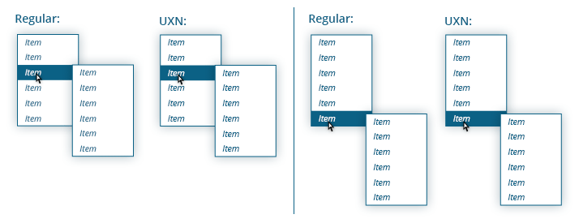

<h1>UXN (1.0 Beta) - Documentation</h1>

UXN allows you to create user-friendly navigations. It tracks, if the mouse is moving to any menu, and if so, then the menu stays opened. As a result, the user need not to browse through the navigation like a robot and be moving the mouse at right angles (see the animation below).

The second function of UXN is adjusting positions of submenus into the browser window (page or element).

UXN works exclusively on the basis of classes (<code>class</code> attribute) and thus it doesn't modify the <code>style</code> attribute of elements. All class names can be changed however you want.

UXN uses native methods and APIs (<code>closest</code>, <code>matches</code>, <code>classList</code>, ...), if they are available to ensure maximum efficiency.

<figure></figure>

<h2>Dependencies</h2>

<strong>jQuery</strong> - tested with version 1.11.3

<h2>Browser support</h2>

All browsers supported by jQuery. Although older browsers (IE7 and lower) can be too slow.

<h2>Basic usage</h2>

<h3>JavaScript</h3>

<pre>var mainNav = new UXN("#main-nav");

//or
var mainNav = new UXN({
    nav: "#main-nav",
    itemOpened: "custom-opened-class"
});</pre>

The default selectors for the submenus and items are <code>ul</code> and <code>li</code>. These can be changed by <code>subnav</code> and <code>item</code> properties. It's important that these selctors do not select any other elements than elements of a submenu or an item.

Note: Do not use selectors like <code>#main-nav .subnav</code>, but only <code>.subnav</code>.

Note: <code>nav</code> selector does not have to be an <code>id</code>, but must be unique.

Note: The default value of the <code>nav</code> property is <code>#main-nav</code>. So if your navigation has the <code>id</code> <code>#main-nav</code>, you can use just <code>new UXN();</code>.

<h3>HTML</h3>

Basic navigation:

<pre>&lt;nav id=&quot;main-nav&quot;&gt;  
    &lt;ul&gt;
        &lt;li&gt;
            &lt;a href=&quot;#&quot;&gt;link&lt;/a&gt;  
            &lt;ul&gt;
                &lt;li&gt;...&lt;/li&gt;
                ...
            &lt;/ul&gt;  
        &lt;/li&gt;
        ...
    &lt;/ul&gt;  
&lt;/nav&gt;</pre>

On touch devices may be useful to use a dedicated opening element (see demo <a href="http://michaljerabek.github.io/UXN#3">#3</a>), if we want to be able to use item's link and be able to open a submenu inside the item. The HTML could look like this:

<pre>&lt;nav id=&quot;main-nav&quot;&gt;  
    &lt;ul&gt;
        &lt;li&gt;
            &lt;a href=&quot;#&quot;&gt;link&lt;/a&gt;  
            &lt;div class=&quot;opener&quot;&gt;
                &lt;span&gt;&rarr;&lt;/span&gt;  
                &lt;ul&gt;
                    &lt;li&gt;...&lt;/li&gt;
                    ...
                &lt;/ul&gt;  
            &lt;/div&gt;  
        &lt;/li&gt;
        ...
    &lt;/ul&gt;  
&lt;/nav&gt;</pre>

Note: Selector for opening elements can be set by <code>opener</code> property.

Note: Last submenus do not have to have any item (see demo <a href="http://michaljerabek.github.io/UXN#4">#4</a>, <a href="http://michaljerabek.github.io/UXN#6">#6</a>, <a href="http://michaljerabek.github.io/UXN#7">#7</a>).

<h3>CSS</h3>

<pre>#main-nav li {
    position: relative;
    ...
}

#main-nav ul ul {
    position: absolute;
    top: 0px;
    left: 100%;
    
    display: none;
    ...
}        

#main-nav li.UXN__item--opened &gt; ul {
    display: block;
}        

#main-nav li.UXN__item--highlighted {
    background-color: red;
    ...
}        
</pre>

<h4>Použití s CSS Tranistions:</h4>

<pre>#main-nav li {
    position: relative;

    overflow: hidden;
    ...
}

#main-nav ul ul {
    position: absolute;
    top: 0px;
    left: 100%;
    
    opacity: 0;
    visibility: hidden;
    
    transition: 
    opacity    0.2s ease-in 0s, 
    visibility 0s           0.2s;
    ...
}        

#main-nav li.UXN__item--has-fading-out,
#main-nav li.UXN__item--opened {
    overflow: visible;
}        

#main-nav li.UXN__item--opened {
    background-color: red;
}        

#main-nav li.UXN__item--opened &gt; ul {
    opacity: 1;
    visibility: visible;
    
    transition: opacity 0.2s ease-out;
}        
</pre>

For more, see the <a href="http://michaljerabek.github.io/UXN#2">demo</a>.

<h2>Classes Used for Browsing a Menu</h2>

<h3>Initialization and Activation</h3>

<ul>
    <li>
        <code>UXN__item--has-subnav</code> (<code>itemHasSubnav</code>):
          - Item with submenu.
    </li>

    <li>
        <code>UXN__opener--has-subnav</code> (<code>openerHasSubnav</code>):
          - Opening element with submenu.
    </li>

    <li>
        <code>UXN</code> (<code>instance</code>):
          - Element that is an instance of UXN (set by the <code>nav</code> property). (Can be used for creating a fallback for users with disabled JS.)
    </li>

    <li>
        <code>UXN--active</code> (<code>activeInstance</code>):
          - Element that is an instance of UXN and user is browsing the menu.
    </li>
</ul>

<h3>Opening of Submenu</h3>

<ul>
    <li>
        <code>UXN__item--opened</code> (<code>itemOpened</code>):
          - Item with an opened submenu. This class should not be used for setting any visual styles (<code>background-color</code>, ...) and should ensure only the opening of submenu (in the final position; [<code>display</code>, <code>transform</code>, <code>left</code>, ...]). (For visual styles can be used <code>UXN__item--highlighted</code>.)
    </li>

    <li>
        <code>UXN__opener--opened</code> (<code>openerOpened</code>):
          - Opening element with an opened submenu. This class should not be used for setting any visual styles (<code>background-color</code>, ...) and should ensure only the opening of submenu (in the final position; [<code>display</code>, <code>transform</code>, <code>left</code>, ...]). (For visual styles can be used <code>UXN__opener--highlighted</code>.)
        </li>

    <li>
        <code>UXN__item--highlighted</code> (<code>itemHighlighted</code>):
          - Item with an opened submenu.
    </li>

    <li>
        <code>UXN__opener--highlighted</code> (<code>openerHighlighted</code>):
          - Opening element with an opened submenu.
    </li>

    <li>
        <code>UXN__subnav--has-opened</code> (<code>subnavHasOpened</code>):
          - Submenu with an opened item.
    </li>

    <li>
        <code>UXN__subnav--current</code> (<code>currentSubnav</code>):
          - Submenu the mouse is over (or last was).
    </li>
</ul>

<h3>Closing of Submenu</h3>

<ul>

    <li>
        <code>UXN__item--has-fading-out</code> (<code>itemHasFadingOut</code>):
          - Item, which submenu is closing. (Only if <code>fading</code> is used.)
    </li>

    <li>
        <code>UXN__opener--has-fading-out</code> (<code>openerHasFadingOut</code>):
          - Opening element, which submenu is closing. (Only if <code>fading</code> is used.)
    </li>

    <li>
        <code>UXN__subnav--has-fading-out</code> (<code>subnavHasFadingOut</code>):
          - Submenu, that has a closing submenu. (Only if <code>fading</code> is used.)
    </li>

    <li>
        <code>UXN-no-fading</code> (<code>noFading</code>):
          - Submenu, that does not use transitions or animations. In case of some submenus use transitions or animations and some not, it's necessary to identify for which submenus should not be expected a <code>transitionend</code> / <code>animationend</code> event (or a <code>done</code> function call in case of using JS animations).
    </li>

    <li>
        <code>UXN-sliding--vertical</code> (<code>slidingVertical</code>):
          - It allows custom control of opening submenus. In case that a submenu has a <code>UXN-sliding--vertical</code> class, the submenu is opened without having to stop the mouse, if mouse is moving vertically.
    </li>

    <li>
        <code>UXN-sliding--horizontal</code> (<code>slidingHorizontal</code>):
          - It allows custom control of opening submenus. In case that a submenu has a <code>UXN-sliding--horizontal</code> class, the submenu is opened without having to stop the mouse, if mouse is moving horizontally.
        </li>
</ul>

Classes containing "fading" are important for the correct work of transitions and animations. They are mainly used to set the element to <code>overflow: visible;</code>, in order to its closing submenu would be visible.

<h3>Other</h3>

<ul>

    <li>
        <code>UXN-exclude</code> (<code>exclude</code>):
          - Submenu that should be excluded from the mouse tracking.
    </li>

    <li>
        <code>UXN-exclude--inside</code> (<code>excludeInside</code>):
          - Submenu that should be excluded from the mouse tracking, if the mouse is inside the submenu. (See demo <a href="http://michaljerabek.github.io/UXN#6">#6</a>.)
          - Useful only if <code>hideFollowing</code> is set to <code>false</code>.
    </li>

    <li>
        <code>UXN-horizontal</code> (<code>horizontal</code>):
          - Submenu, which is horizontal. (Important, if <code>allowSliding</code> is set to <code>true</code>. <a href="#allowSliding">More info</a>.)
    </li>
</ul>

<h2>Adjusting Positions</h2>

Basic process is as follows:

<ol>
    <li>Set styles for submenus to default direction. (For example: Submenus will be positioned down right)</li>
    <li>Set styles to classes in the opposite direction. (For example <code>UXN__subnav--top</code> and <code>UXN__subnav--left</code>.)</li>
</ol>

If a submenu fits into the window (page, element) and thus its position is not changed, the submenu will not have any class except in the case, that adjusting positions from the center is used. <a href="#firstLevelPositionsFromCenter">More info.</a>

If the positions are adjusted by the page (<code>&lt;html&gt;</code>) and the page is smaller then the browser window, the window is used instead.

If a submenu does not fit into the window (page, element) even in the changed position, direction down right is preferred.

The first level of submenus can be adjusted by a different base then the others. In that case the property <code>firstLevelPositionsFromCenter</code> is set to <code>true</code>, if the property is not explicitly set to <code>false</code>. The other submenus will then continue the direction from the first level.

Setting the base for positioning:

<pre>var mainNav = new UXN({
    nav: "#main-nav",
    positionBase: UXN.POSITION_BASE.PAGE // UXN.POSITION_BASE.WINDOW // $("#wrapper") // document.getElementById("wrapper")
});</pre>

Classes used for adjusting positions

<ul>

    <li>
        <code>UXN-position--skip</code> (<code>positionSkip</code>):
          - It may be set to submenus that should not be positioned. Typically, the first level of submenus. (May be set by code>positionSkipOnFirstLevel: true</code>, in this case, you don't have to add these classes.)
    </li>

    <li>
        <code>UXN__subnav--left</code> (<code>subnavLeft</code>) |
        <code>UXN__subnav--right</code> (<code>subnavRight</code>) |
        <code>UXN__subnav--top</code> (<code>subnavTop</code>) |
        <code>UXN__subnav--bottom</code> (<code>subnavBottom</code>):
          - A submenu which should be positioned in the corresponding direction.
    </li>

    <li>
        <code>UXN__item--has--left</code> (<code>itemHasLeft</code>) |
        <code>UXN__item--has--right</code> (<code>itemHasRight</code>) |
        <code>UXN__item--has--top</code> (<code>itemHasTop</code>) |
        <code>UXN__item--has--bottom</code> (<code>itemHasBottom</code>):
          - An item with a submenu in the corresponding direction.
    </li>

    <li>
        <code>UXN__opener--has--left</code> (<code>openerHasLeft</code>) |
        <code>UXN__opener--has--right</code> (<code>openerHasRight</code>) |
        <code>UXN__opener--has--top</code> (<code>openerHasTop</code>) |
        <code>UXN__opener--has--bottom</code> (<code>openerHasBottom</code>):
          - An opening element with a submenu in the corresponding direction.
        </li>
</ul>

Note: The process of adujsting positions causes delay before the corresponding submenu is opened. Some browsers (IE) may not respond for a few milliseconds.

<h2>Options</h2>

To set up custom classes, see above.

Options can be changed at runtime by <code>instance.opt.property</code>, but do not change classes.

<ul>

    <li>
        <code>nav</code> (default: <code>"#main-nav"</code>):
          - Selector for an element wrapping the navigation (Must be unique.)
          - Type: <code>String</code>
    </li>

    <li>
        <code>item</code> (default: <code>"li"</code>):
          - Selector for items of the navigation. (Inside the navigation the selector must not select anything but items.)
          - Type: <code>String</code>
    </li>

    <li>
        <code>subnav</code> (default: <code>"ul"</code>):
          - Selector for submenus of the navigation. (Inside the navigation the selector must not select anything but submenus.)
          - Type: <code>String</code>
    </li>

    <li>
        <code>opener</code> (default: value from <code>item</code>):
          - Selector for opening elements of the navigation. (Inside the navigation the selector must not select anything but opening elements.)
          - Type: <code>String</code>
    </li>

    <li>
        <code>closer</code> (default: <code>"a"</code>):
          - Selector for elements closing the navigation on click.
          - Type: <code>String</code>
    </li>

    <li>
        <code>autoSleep</code> (default: <code>true</code>):
          - The navigation stop responding to events, if it's outside the viewport (or inside an element with <code>display: none</code>).
          - Type: <code>Boolean</code>
    </li>

    <li>
        <code>fading</code> (default: <code>UXN.FADING_TYPE.NONE</code>):
          - Sets, whether the navigation uses CSS Transitions, CSS Animations or JavaScript animations.
          - Options: <code>UXN.FADING_TYPE.TRANSITION</code> |
        <code>UXN.FADING_TYPE.ANIMATION</code> |
        <code>UXN.FADING_TYPE.JS</code> |
        <code>UXN.FADING_TYPE.NONE</code>
          - Type: <code>UXN.FADING_TYPE</code>
    </li>

    <li>
        <code>animation</code> (default: <code>"UXN-hide"</code>):
          - Název animace (nebo pole názvů), která zavírá nabídku.
          - Name of the animation (or array with names) used for closing a submenu.
          - Type: <code>String</code> / <code>Array</code>
    </li>

    <li>
        <code>delayHide</code> (default: <code>false</code>):
          - Sets, whether an opened submenu should be closed immediately after the mouse leaves the item or just before another submenu is opened (or the mouse is not moving for an <code>openTimeout</code>).
          - Type: <code>Boolean</code>
    </li>

    <li>
        <code>autoHide</code> (default: <code>true</code>):
          - Sets, if in the case, that the mouse is stopped outside the navigation, the navigation should be automatically closed after an <code>outsideTimeout</code>.
          - Type: <code>Boolean</code>
    </li>

    <li>
        <code>closeOnlyInLevel</code> (default: <code>false</code>):
          - It will only close the submenu, which is at the same level as the newly opened. This allows you to keep open the last submenu. See demo <a href="http://michaljerabek.github.io/UXN#6">#6</a>.
          - Type: <code>Boolean</code>
    </li>

    <li>
        <code>doNotCloseFirstLevel</code> (default: <code>false</code>):
          - The last opened submenu at the first level stays always opened. (During the initialization a submenu at the first level can be opened by an <code>onInit</code> handler by using <code>open</code> method.)
          - Type: <code>Boolean</code>
    </li>

    <li>
        <code>hideFollowing</code> (default: <code>true</code>):
          - Sets, if the submenus following a submenu the mouse is over should be immediately closed even if the <code>insideTimeout</code> timer did not elapse. (Applicable if the user is browsing the navigation [moving the mouse] backwards.) If the <code>insideTimeout</code> is set to a longer time and <code>hideFollowing</code> to <code>false</code>, then the user may return back, if he/she realizes, that the searched item is inside already opened submenu (several levels down), but he/she had moved back into a different submenu (several levels up).
          - Type: <code>Boolean</code>
    </li>

    <li>
        <code>keepOpened</code> (default: <code>true</code>):
          - The last opened item stays opened even if the mouse is outside of any item (but inside the same submenu).
          - Type: <code>Boolean</code>
    </li>

    <li>
        <code>excludeFirstLevel</code> (default: <code>true</code>):
          - Excludes the first level from mouse tracking.
          - Type: <code>Boolean</code>
    </li>

    <li id="allowSliding">
        <code>allowSliding</code> (default: <code>true</code>):
          - Sets, if the user does not have to stop the mouse over an item for a time set by <code>openTimeout</code> before a submenu is opened. This feature takes into account the layout of the current submenu. In case that <code>ignoreLayoutOnSliding</code> is set to <code>false</code> (default), it is necessary to add a class specified in <code>horizontal</code> to submenus, which are horizontal. (The default behavior can be overridden using classes.)
          - If the adjusting of positions is used, opening will be delayed a little more.
          - Type: <code>Boolean</code>
    </li>

    <li>
        <code>allowSlidingOnFirstLevel</code> (default: <code>false</code>):
          - Sets, if <code>allowSliding</code> is used even for the first level.
          - Type: <code>Boolean</code>
    </li>

    <li>
        <code>ignoreLayoutOnSliding</code> (default: <code>false</code>):
          - Sets, if <code>allowSliding</code> feature should take into account the layout of the current submenu. (If a submenu is vertical, the need to stop the mouse will be applied only if the mouse is moving vertically.) 
          - Type: <code>Boolean</code>
    </li>

    <li>
        <code>slidingZone</code> (výchozí: <code>75</code>):
          - Nastavuje procentuální velikost zóny (od strany vzálenější od kurzoru), ve které se nebude otevírání nabídky spožďovat, pokud se myš pohybuje v opačném směru než je rozložení nabídky. (Je-li nabídka vertikální a myš se pohybuje horizontálně v této zóně, otevření se nespozdí.)
          - Typ: <code>Number</code>
    </li>

    <li>
        <code>openTimeout</code> (výchozí: <code>30</code>):
          - Určuje dobu, na kterou musí uživatel zastavit myš nad položkou, aby se otevřela.
          - Pokud používáte nastavování pozic, pak se spoždění o něco prodlouží.
          - Typ: <code>Number</code>
    </li>

    <li>
        <code>preventClickOnTouch</code> (výchozí: <code>true</code>):
          - Nastavuje, jestli se má po tapnutí (<code>"ontouchend"</code>) na položku, která má podnabídku a nemá otevírací element, zablokovat události kliknutí. (<code>"onclick"</code>)
          - Typ: <code>Boolean</code>
    </li>

    <li>
        <code>closeOnClick</code> (výchozí: <code>false</code>):
          - Nastavuje, jestli se má po kliknutí (kamkoliv) nabídka zavřít nebo zůstat otevřená.
          - Typ: <code>Boolean</code>
    </li>

    <li>
        <code>mouseTolerance</code> (výchozí: <code>1</code>):
          - Počet pixelů před kurzorem ve směru jeho pohybu, které mají být brány v úvahu při testování, jestli uživatel směřuje k nabídce. (Pokud je nabídka například vysoká a položky, které ji otevírají úzké, může být lepší toleranci nastavit na <code>0</code>.)
          - Typ: <code>Number</code>
    </li>

    <li>
        <code>minZoneExt</code> (výchozí: <code>25</code>):
          - Nastavuje minimální rozšíření oblasti, která je považovaná za směřování k nabídce. (Míra rozšíření se zvětšuje s rostoucí vzdáleností myši od nabídky. Pro ukázku viz <a href="http://michaljerabek.github.io/UXN#2">demo</a> se zapnutým debug módem.)
          - Typ: <code>Number</code>
    </li>

    <li>
        <code>maxZoneExt</code> (výchozí: <code>250</code>):
          - Nastavuje maximální rozšíření oblasti, která je považovaná za směřování k nabídce. (Míra rozšíření se zvětšuje s rostoucí vzdáleností myši od nabídky. Pro ukázku viz <a href="http://michaljerabek.github.io/UXN#2">demo</a> se zapnutým debug módem.)
          - Typ: <code>Number</code>
    </li>

    <li>
        <code>zoneExtOffset</code> (výchozí: <code>0</code>):
          - Nastavuje fixní rozšíření (zúžení) oblasti, která je považovaná za směřování k nabídce. (Hodnota se přičte k celkovému výsledku.)
          - Typ: <code>Number</code>
    </li>

    <li>
        <code>surroundingZone</code> (výchozí: <code>15</code>):
          - Velikost oblasti kolem nabídky, na kterou může uživatel najet, ikdyž kurzorem směřuje od nabídky. Navigace se zavře za čas nastavený v <code>surroundingTimeout</code>.
          - Typ: <code>Number</code>
    </li>

    <li>
        <code>insideTimeout</code> (výchozí: <code>30</code> a více - podle prohlížeče):
          - Doba, za kterou se nabídka zavře, pokud uživatel nepohybuje myší směrem k ní, pokud se nachází uvnitř navigace.
          - Typ: <code>Number</code>
    </li>

    <li>
        <code>outsideTimeout</code> (výchozí: <code>400</code>):
          - Doba, za kterou se navigace zavře, pokud uživatel nepohybuje myší směrem k nabídce, pokud se nachází mimo navigaci.
          - Typ: <code>Number</code>
    </li>

    <li>
        <code>surroundingTimeout</code> (výchozí: <code>600</code>):
          - Po uplynutí zadané doby, pokud je myš mimo zónu považovanou za směřující k nabíce a zároveň uvnitř <code>surroundingZone</code>, se navigace zavře.
          - Typ: <code>Number</code>
    </li>

    <li>
        <code>isFadedOut</code>:
          - Funkce pro zjištění, jestli je nabídka uzavřená. Důležité pro správné fungování CSS Transitions. Výchozí funkce zjišťuje, jestli došlo k ukončení přechodu u vlastnosti <code>visibility</code>.
          - Parametry:
         
        <ul>
            <li><code>jQuery</code> - element nabídky</li>
            <li><code>TransitionEvent</code></li>
            <li><code>Function</code> - callback oznamující zavření nabídky, který může být zavolán později.</li>
        </ul>
        - Funkce musí vrátit <code>false</code>, pokud nedošlo k uzavření nabídky. V případě, že ano, pak <code>true</code>.
          - Při používání přechodů výrazně doporučuji používat vzor použitý výše (nabídka se zobrazuje/skrývá pomocí <code>visibility</code>, která je nastavená i v <code>transition</code> se spožděním, a třída <code>UXN__item--opened</code> odstraňuje <code>visibility</code> z <code>transition</code>.), protože <code>TransitionEvent</code> při rychlém přepínání nemusí nastat (v případě <code>visibility</code> ale funguje pokaždé) nebo se může zachytit ještě předcházející událost. - Typ: <code>Function &lt;= boolean</code>
    </li>

    <li>
        <code>onInit</code> (výchozí: <code>null</code>):
          - Funkce se zavolá na konci inicializace.
          - Typ: <code>Function</code>
    </li>

    <li>
        <code>onSubnavChange</code> (výchozí: <code>null</code>):
          - Funkce se zavolá při přejetí na jinou nabídku.
          - Parametry:
         
        <ul>
            <li><code>jQuery</code> - element aktuální nabídky</li>
        </ul>

        - Typ: <code>Function</code>
    </li>

    <li>
        <code>onOpen</code> (výchozí: <code>null</code>):
          - Funkce se zavolá před otevřením nabídky. V případě, že funkce vrátí <code>false</code>, nabídka se neotevře. Funkce může být použita pro JavaScriptové animace.
          - Parametry:
         
        <ul>
            <li><code>jQuery</code> - element nabídky</li>
            <li><code>jQuery</code> - element položky.</li>
            <li><code>jQuery</code> - element otevíracího prvku</li>
        </ul>

        - Typ: <code>Function [&lt;= boolean]</code>
    </li>

    <li>
        <code>onClose</code> (výchozí: <code>null</code>):
          - Funkce se zavolá před zavřením nabídky. V případě, že funkce vrátí <code>false</code>, nabídka se nezavře.
          - Funkce může být použita pro JavaScriptové animace. V takovém případě, je potřeba nastavit vlastnost <code>fading</code> na <code>UXN.FADING_TYPE.JS</code> a po skončení animace, zavolat callback (čtvrtý parametr) a odstranit z atributu <code>style</code> vlastnosti[1], které odstraňují element z dokumentu (<code>display</code>). Třída <code>UXN__item--opened</code> musí otevírat nabídku i přesto, že je to zajištěno JS[2]. Viz demo <a href="http://michaljerabek.github.io/UXN#5">#5</a>. (*1 a *2 platí, pokud se používá nastavování pozic.)
          - Parametry:
         
        <ul>
            <li><code>jQuery</code> - element nabídky</li>
            <li><code>jQuery</code> - element položky.</li>
            <li><code>jQuery</code> - element otevíracího prvku</li>
            <li><code>Function</code> - callback oznamující zavření nabídky po skončení animace.</li>
        </ul>

        - Typ: <code>Function [&lt;= boolean]</code>
    </li>

    <li>
        <code>waitForFading</code> (výchozí: <code>false</code>):
          - Ve výchozím nastavení je možné používat jen jednu instanci UXN. Díky tomu, v případě že procházíte navigací a přejedete myší přes jinou navigaci UXN, se tato navigace neotevře. Vlastnost <code>waitForFading</code> určuje, že se může další navigace otevřít až po té, co všechny nabídky kompletně zavřou (dokončí se přechody [transitions] nebo animace). Nastavením na <code>true</code> můžete předejít případnému překrývání nabídek.
          - Typ: <code>Boolean</code>
    </li>

    <li>
        <code>setPositions</code> (výchozí: <code>true</code>):
          - Zapíná nastavování pozic nabídek, aby směřovaly do okna (stránky, elementu).
          - Typ: <code>Boolean</code>
    </li>

    <li>
        <code>setPositionsOnReset</code> (výchozí: <code>true</code>):
          - Pozice se budou nastavovat i po skrolování.
          - Typ: <code>Boolean</code>
    </li>

    <li>
        <code>setPositionsOnDeactivation</code> (výchozí: <code>true</code>):
          - Pozice se přenastaví i po zavření navigace.
          - Typ: <code>Boolean</code>
    </li>

    <li>
        <code>setPositionsOnElement</code> (výchozí: <code>false</code>):
          - Pozice se budou nastavovat i po změně velikosti stránky nebo elementu nastaveného v <code>positionBase</code>a <code>firstLevelPositionBase</code>.
          - Typ: <code>Boolean</code>
    </li>

    <li>
        <code>positionSkipOnFirstLevel</code> (výchozí: <code>true</code>):
          - Při nastavování pozic budou ignorovány první podnabídky.
          - Typ: <code>Boolean</code>
    </li>

    <li>
        <code>positionBase</code> (výchozí: <code>UXN.POSITION_BASE.WINDOW</code>):
          - Určuje, jestli se mají pozice nabídek nastavovat podle okna prohlížeče, stránky (<code>&lt;html&gt;</code>) nebo konkrétního elementu.
          - Možnosti: <code>UXN.POSITION_BASE.WINDOW</code> | <code>UXN.POSITION_BASE.PAGE</code>
          - Typ: <code>UXN.POSITION_BASE</code> / <code>jQuery</code> / <code>HTMLElement</code>
    </li>

    <li>
        <code>firstLevelPositionBase</code> (výchozí: <code>UXN.POSITION_BASE.WINDOW</code>):
          - Určuje, jestli se mají pozice první úrovně nabídek nastavovat podle okna prohlížeče, stránky (<code>&lt;html&gt;</code>) nebo konkrétního elementu.
          - Není-li specifikováno v nastavovacím objektu (<code>options</code>) jinak, <code>fristLevelPositionsFromCenter</code> se nastaví na <code>true</code> a <code>positionSkipOnFirstLevel</code> na <code>false</code>.
          - Možnosti: <code>UXN.POSITION_BASE.WINDOW</code> | <code>UXN.POSITION_BASE.PAGE</code>
          - Typ: <code>UXN.POSITION_BASE</code> / <code>jQuery</code> / <code>HTMLElement</code>
    </li>

    <li id="firstLevelPositionsFromCenter">
        <code>firstLevelPositionsFromCenter</code> (výchozí: <code>false</code>):
          - Pozice na první úrovni podnabídek se nastaví tak, aby směřovaly do většího prostoru (podle umístění položek na stránce). Ostatní nabídky přejímají nastavení rodičovských nabídek, pokud je to možné. Vhodné pro nabídky, které jsou uprostřed stránky.
          - Typ: <code>Boolean</code>
    </li>

    <li>
        <code>positionOffset</code> (výchozí: <code>10</code>):
          - Prostor v pixelech, který má být kolem nabídek od hran <code>positionBase</code>.
          - Typ: <code>Number</code>
    </li>

    <!--
<li>
<code>onResetPositionsStart</code> (výchozí: <code>null</code>):  

- Funkce se spustí před přenastavováním pozic nabídek. V případě, že funkce vrátí <code>false</code>, operace se nespustí. 

- Typ: <code>Function [&lt;= boolean]</code>
</li>

<li>
<code>onResetPositionsEnd</code> (výchozí: <code>null</code>):  

- Funkce se spustí po přenastavení pozic nabídek. 

- Typ: <code>Function</code>
</li>
-->

    <li>
        <code>debug</code> (výchozí: <code>false</code>):
          - Aktivuje zobrazování testovaných zón pro zjištění, jestli uživatel směřuje k nabídce, a přidávání tříd. Není k dispozici v minifikované verzi. (Doporučuji testovat v Chromu, Opeře nebo ve Firefoxu. Nelze vyloučit nesprávnou funkčnost kvůli neznámenu nastavení CSS.)
          - Typ: <code>Boolean</code>
    </li>

</ul>

<h2>Globální nastavení</h2>

<ul>

    <li>
        <code>UXN.VENDOR_PREFIXES</code> (výchozí: <code>false</code>):
          - Nastavuje, jestli přechody (transitions) nebo animace používají CSS prefixy (<code>-webkit-</code>, <code>-moz-</code>, ...).
          - Typ: <code>Boolean</code>
    </li>

    <li>
        <code>UXN.MULTIPLE_INSTANCES</code> (výchozí: <code>false</code>):
          - Nastavuje, jestli je možné používat více instancí najednou.
          - Typ: <code>Boolean</code>
    </li>

    <li>
        <code>UXN.SKIP_MOUSE_EVENTS</code> (výchozí: <code>0</code>):
          - Určuje, kolik událostí <code>onmousemove</code> se má přeskočit. V případě použití delšího času <code>insideTimeout</code> můžete prohlížeči ušetřit trochu práce.
          - Typ: <code>Number</code>
    </li>

    <li>
        <code>UXN.DEFAULTS</code> (výchozí: <code>{...}</code>):
          - Výchozí nastavení.
          - Typ: <code>Object</code>
    </li>

    <li>
        <code>UXN.PREFIX</code> (výchozí: <code>"UXN"</code>):
          - Prefix nastavovaných výchozích tříd a dat přiřazených k elementům.
          - Typ: <code>String</code>
    </li>

    <li>
        <code>UXN.EVENT_NS</code> (výchozí: <code>"UXN"</code>):
          - Jmenný prostor (namespace) událostí.
          - Typ: <code>String</code>
    </li>

    <li>
        <code>UXN.BEM.EL</code> (výchozí: <code>"__"</code>):
          - Oddělovač bloku a elementu ve výchozích třídách.
          - Typ: <code>String</code>
    </li>

    <li>
        <code>UXN.BEM.MOD</code> (výchozí: <code>"--"</code>):
          - Oddělovač elementu a modifikátoru ve výchozích třídách.
          - Typ: <code>String</code>
    </li>

    <li>
        <code>UXN.POSITIONS.IDS.STYLE</code> (výchozí: <code>"UXN-positioning__reset-start"</code>):
          - <code>id</code> elementu <code>style</code> v elementu <code>head</code> používaný pro resetování pozic nabídek.
          - Typ: <code>String</code>
    </li>

    <li>
        <code>UXN.POSITIONS.CLASSES.RESET</code> (výchozí: <code>"UXN-positioning__style" </code>):
          - Třída použitá pro resetování pozic nabídek.
          - Typ: <code>String</code>
    </li>

    <li>
        <code>UXN.DEBUG</code>:
          - Nastavení debug módu.
    </li>

</ul>

<h2>Metody</h2>

<ul>

    <li>
        <code>destroy()</code>:
          - Odstraní instanci.
         
    </li>

    <li>
        <code>refresh([options])</code>:
          - Obnoví instanci.
          - Parametry:
         
        <ul>
            <li><code>Object</code> - nové nastavení</li>
        </ul>
    </li>

    <li>
        <code>open(subnav [, notParents]) &lt;= <code>Boolean</code></code>:
          - Otevře nabídku. V případě otevření (nenastala chyba) vrací <code>true</code>, jinak <code>false</code>.
          - Parametry:
         
        <ul>
            <li><code>String</code> / <code>HTMLElement</code> / <code>jQuery</code> - nabídka, která se má otevřít.</li>
            <li><code>Boolean</code> - neotevírat nadřazené nabídky.</li>
        </ul>
    </li>

    <li>
        <code>close([subnav, preserveFirstLevel]) &lt;= <code>Boolean</code></code>:
          - Zavře nabídku. V případě zavření vrací <code>true</code>, jinak <code>false</code>. Pokud je metoda volána bez parametrů, zavře se celá navigace.
          - Parametry:
         
        <ul>
            <li><code>String</code> / <code>HTMLElement</code> / <code>jQuery</code> - nabídka, která se má zavřít.</li>
            <li><code>Boolean</code> - v případě zapnutí <code>doNotCloseFirstLevel</code> neskryje nabídku první úrovně.</li>
        </ul>
    </li>

    <li>
        <code>sleep([touchEvents])</code>:
          - Instance přestane reagovat na události.
          - Parametry:
         
        <ul>
            <li><code>Boolean</code> - vypnou se i dotykové události.</li>
        </ul>
    </li>

    <li>
        <code>wake()</code>:
          - Instance opět začne reagovat na události.
         
    </li>

    <li>
        <code>toggleDebug()</code>:
          - Vypne/zapne debug mód. (Není k dispozici v minifikované verzi.)
         
    </li>

    <li>
        - Spousta dalších samovysvětlujících metod pro procházení navigací. Doporučuji prostudovat ve vývojářských nástrojích v Chromu.
    </li>
</ul>

Upozornění: Nativní metody jako <code>querySelector</code> a <code>querySelectorAll</code> nevybírají vždy ty samé elementy jako jQuery (a nepoužívají úplně stejné selektory). Používejte proto jenom selektory, které vždy vyberou to samé. Více info <a href="https://www.lvh.io/posts/queryselectorall-from-an-element-probably-doesnt-do-what-you-think-it-does.html">zde</a>.

